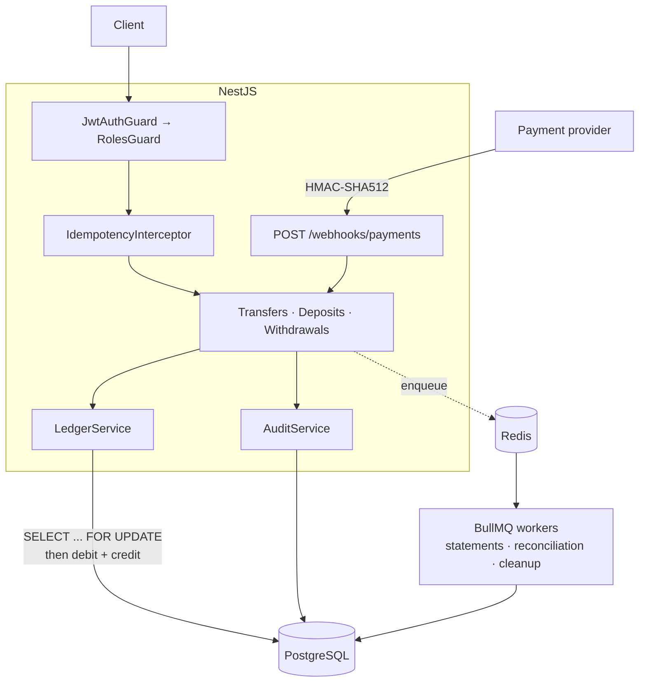

# Seledge

[](https://github.com/Akinyemi-Boluwatife/seledge/actions/workflows/ci.yml)

A double-entry wallet and ledger API. Users deposit, transfer to each other, and
withdraw. Balances are derived from an append-only ledger rather than stored in
a mutable column.

The design goal is correctness under failure and concurrency: no negative
balances, no double-spends, no double-applied retries, no half-completed
transfers.

**Stack:** NestJS 11 · Prisma 7 · PostgreSQL 18 · Redis 8 · BullMQ · JWT ·
Docker

---

## Run it

Everything, in one command:

```bash
docker compose --profile full up -d --build
```

That starts Postgres and Redis, applies migrations, then starts the API once the
database reports healthy. API at `http://localhost:3000/api/v1`, interactive docs
at `http://localhost:3000/docs`, health at `http://localhost:3000/health`.

For development, run the databases in Docker and the app on the host with hot
reload:

```bash
docker compose up -d
```

```bash
npm install && npx prisma migrate dev && npx prisma db seed && npm run start:dev
```

Seeded logins, all with password `password123`:

| Email | Role | Opening balance |
|---|---|---|
| `alice@seledge.test` | user | ₦50,000 |
| `bob@seledge.test` | user | ₦50,000 |
| `admin@seledge.test` | admin | — |

Deployment instructions for a free Render + Neon + Upstash setup are in
[DEPLOY.md](DEPLOY.md).

---

## Architecture



Every money movement follows the same path: guards authenticate, the
idempotency interceptor claims the request key, the service validates and opens
a database transaction, `LedgerService` locks the accounts and writes a balanced
pair of entries, and `AuditService` records what happened — all committing
together or not at all.

### Core rules

- **Money is integer minor units (kobo).** Never floats. Stored as `BigInt`,
  serialized as strings over HTTP so JavaScript clients cannot silently lose
  precision above 2^53.
- **The ledger is the source of truth.** `balance = SUM(credits) − SUM(debits)`.
  `accounts.cachedBalance` is a cache written inside the same transaction;
  `GET /accounts/:id/balance` returns both plus an `inSync` flag.
- **Ledger entries and audit logs are append-only**, enforced by database
  triggers that reject `UPDATE` and `DELETE`. Corrections happen through new
  reversing transactions.
- **Every transaction nets to zero.** `LedgerService` refuses to write an
  unbalanced set. Deposits and withdrawals balance against a seeded
  `SYSTEM_CASH` account, which is expected to run negative.

---

## Concurrency: why pessimistic locking

Transfers take `SELECT ... FOR UPDATE` row locks on both accounts inside the
transaction, ordered by id, before reading balances.

**Why pessimistic over optimistic:** a transfer is short, touches exactly two
rows, and conflicts on a hot account are common rather than rare. Optimistic
locking would mean version columns, retry loops, and a client-visible failure
mode to explain. `FOR UPDATE` puts the correctness in one place — the balance
you read is the balance you write against.

**Why `ORDER BY id`:** simultaneous A→B and B→A transfers would otherwise lock
the two rows in opposite orders and deadlock. A consistent order means one
waits for the other.

**Failure mode:** transfers from the same account serialize. Under heavy load on
one account, throughput drops and requests queue. Correctness holds; latency
does not.

### The demo

Before locking existed, ten parallel ₦300 transfers against a ₦1,000 balance
produced three successes and **seven HTTP 500s** — raw `CHECK` constraint
violations. The money was correct, but only because the database caught what the
application missed.

With locking, the same test gives the required result:

```
10 parallel transfers of ₦300 against ₦1,000
  → 3 × 201 Created
  → 7 × 422 INSUFFICIENT_FUNDS
  → final balance ₦100, ledger sum matches, zero 5xx
```

Run it yourself:

```bash
npm run test:e2e -- --testPathPatterns=concurrency
```

**Defence in depth:** a `CHECK` constraint independently rejects any user
account balance below zero. The application should never rely on it — but when
locking was removed during testing, it was the only thing preventing real
corruption.

---

## Idempotency

`POST /transfers` and `POST /withdrawals` require an `Idempotency-Key` header.
Keys are scoped per user and expire after 24 hours.

- Retrying with the same key replays the original response; the transfer applies
  once.
- Same key with a different body → `409 IDEMPOTENCY_CONFLICT`.
- A retry arriving while the original is still in flight → `409
  REQUEST_IN_PROGRESS`.
- If the handler fails, the key is released so a retry can proceed.

The claim is committed before the transfer runs and deliberately sits outside
the transfer's transaction — sharing it would let a rollback erase the claim and
allow a double-apply. The unique constraint on `(userId, key)` is what makes
five simultaneous retries resolve to exactly one applied transfer.

---

## Errors

Every failure returns the same envelope:

```json
{
  "statusCode": 422,
  "error": "INSUFFICIENT_FUNDS",
  "message": "Insufficient funds: balance 150000, attempted 200000",
  "timestamp": "2026-08-12T10:00:00.000Z",
  "path": "/api/v1/transfers"
}
```

`error` is a stable machine-readable code; `message` is for humans. Unhandled
exceptions become `500 INTERNAL_ERROR` with no stack trace.

| Code | HTTP |
|---|---|
| `VALIDATION_ERROR` | 400 |
| `INVALID_CREDENTIALS`, `INVALID_SIGNATURE` | 401 |
| `ACCOUNT_FROZEN`, `FORBIDDEN` | 403 |
| `ACCOUNT_NOT_FOUND`, `TRANSACTION_NOT_FOUND` | 404 |
| `EMAIL_EXISTS`, `IDEMPOTENCY_CONFLICT`, `REQUEST_IN_PROGRESS` | 409 |
| `INSUFFICIENT_FUNDS`, `SELF_TRANSFER`, `CURRENCY_MISMATCH` | 422 |

---

## Testing

```bash
npm test          # 51 unit tests, no database
npm run test:e2e  # 102 integration tests against real Postgres and Redis
```

Integration tests run against a separate `seledge_test` database, reset with
`TRUNCATE` between tests — `DELETE` would hit the append-only triggers.

What the suite proves beyond the happy path:

- a failed transfer leaves **zero** side effects: no transaction row, no ledger
  entries, no audit record
- balances across every account always sum to zero, so money is never created
- ten parallel transfers overdraw nothing and return clean 422s
- opposing transfers between the same pair never deadlock
- five concurrent requests with one idempotency key apply exactly once
- an invalid webhook signature changes no balance
- reconciliation flags a corrupted cached balance and **does not repair it**
- `UPDATE`/`DELETE` on ledger entries and audit logs are rejected by the database

The locking and no-auto-repair behaviours were verified by mutation: removing
the lock, and making reconciliation self-heal, each break tests.

---

## Background jobs

| Job | Trigger | Behaviour |
|---|---|---|
| Statement generation | user request | derives a month from the ledger, asserts opening + movement = closing |
| Reconciliation | nightly 02:00 + admin | recomputes every balance, reports drift, never fixes it |
| Idempotency cleanup | hourly | deletes expired keys |

Schedules live in Redis and are upserted by id on boot, so restarts update the
schedule rather than stacking duplicate timers.

---

## Resolved decisions

| Decision | Choice | Why |
|---|---|---|
| Locking | Pessimistic (`FOR UPDATE`) | Simpler to reason about; conflicts are common, not rare |
| Amounts | `BigInt` minor units, string over HTTP | Floats lose money; JS numbers break above 2^53 |
| Non-owned account | `404`, not `403` | A 403 confirms the record exists, enabling id enumeration |
| Auth guard | Global, with `@Public()` opt-out | Fails closed: a forgotten decorator returns 401, not open access |
| Audit writes | Inside the action's transaction | An unaudited transfer is worse than a failed one |
| Refresh tokens | Not implemented | Stretch goal in the spec |

---

## Out of scope

Microservices and message brokers, distributed locks, Prometheus/Grafana,
GraphQL, Kubernetes, multi-currency FX, real payment provider integration, KYC,
fees, overdrafts.
